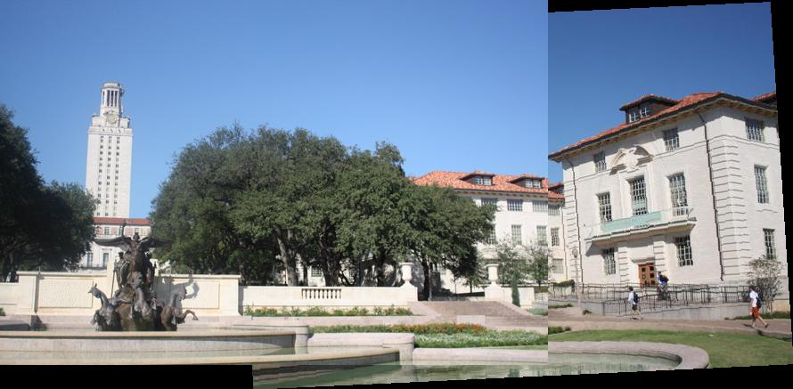
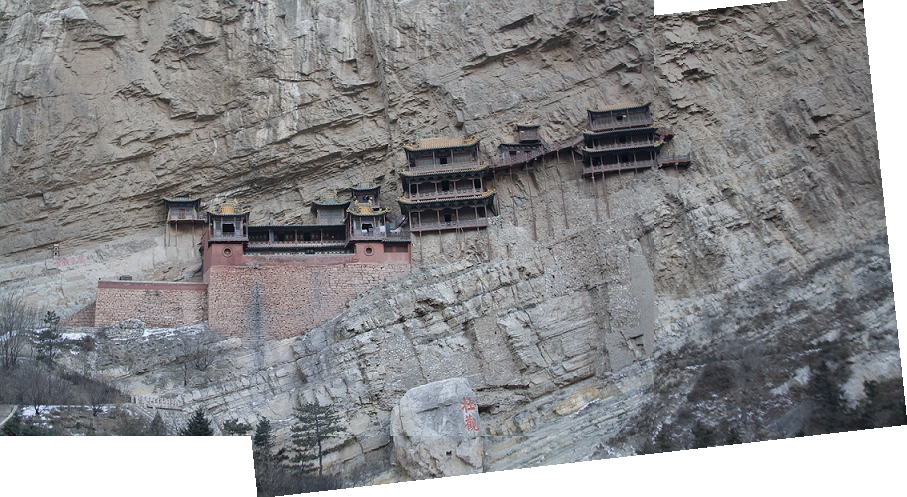
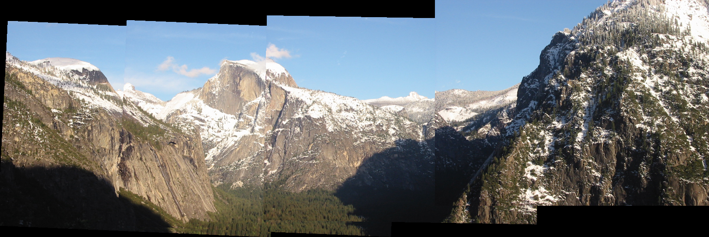
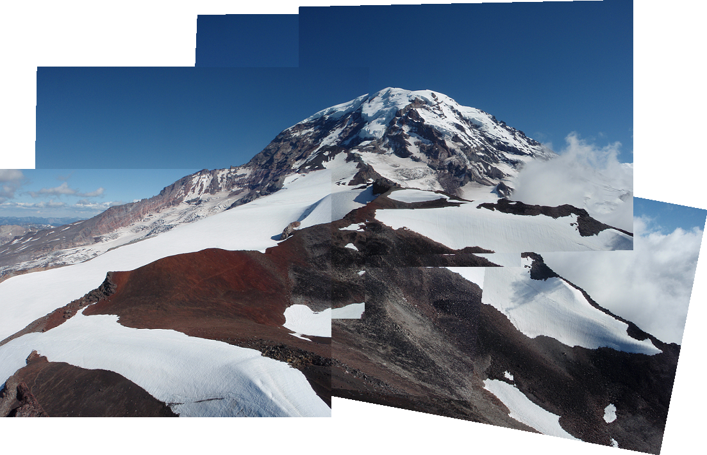

# 林秉言 <span style="color:red">(106061524)</span>

# Project 2 / Panorama Stitching

## Overview
The project is to learn how to


## Implementation
1. Matching SIFT Descriptors
	* item
	* item

```
Code highlights
```

1. Fitting the Transformation Matrix
	* item
	* item

```
Code highlights
```

1. RANSAC
	* item
	* item

```
Code highlights
```

1. Stitching Multiple Images
	* item
	* item

```
Code highlights
```

## Installation
* Other required packages.
* How to compile from source?

### Results

There are some examples I processed with image stitching.
The first two images are both combination of two images, and the two images
below are combined with multiple images.

images used to form a panorama:2
<table border=1>
<tr>
<td>

</td>
</tr>
<tr>
<td>

</td>
</tr>

</table>

images used to form a panorama:4
<table border=1>
<tr>
<td>

</td>
</tr>

</table>

images used to form a panorama:6
<table border=1>
<tr>
<td>

</td>
</tr>

</table>
